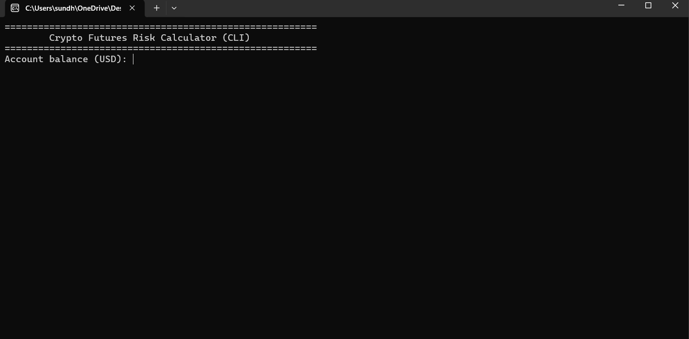

# Crypto Futures Risk Calculator

## 📸 Demo



A lightweight CLI tool that helps traders calculate safe position sizing,
risk exposure, and liquidation estimates for crypto futures trading.

---

## 🚀 Features
- Position size calculation
- Risk percentage control
- Liquidation price estimation
- Risk-to-reward calculation
- Standalone Windows executable

---

## ⚡ Quick Start

### Option 1 — Windows (Recommended)
1. Go to **Releases**
2. Download `calculator.exe`
3. Double-click to run

### Option 2 — Python
```bash
python calculator.py
```

---

## 📊 Example

```
Account balance: 1000
Leverage: 10
Entry price: 50000
Stop loss: 49000
Risk: 2%
```

Output:

```
Recommended position size: 0.02 BTC
Dollar risk: $20
Liquidation estimate: $45,250
```

---

## 🧠 Why This Tool Exists

Most traders oversize positions and get liquidated.
This calculator enforces disciplined risk management using fixed-risk position sizing.

---

## 🛠 Tech Stack
- Python
- CLI Application
- PyInstaller (Windows EXE)

---

## 📦 Download

Download the latest version from the **Releases** section.

---

## 📄 License
MIT License
